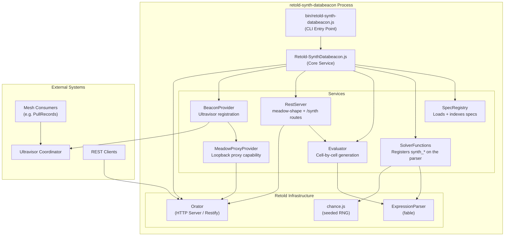
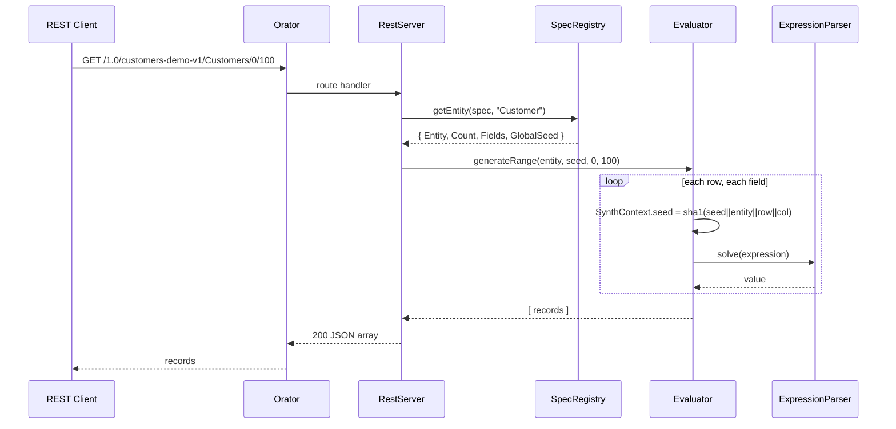
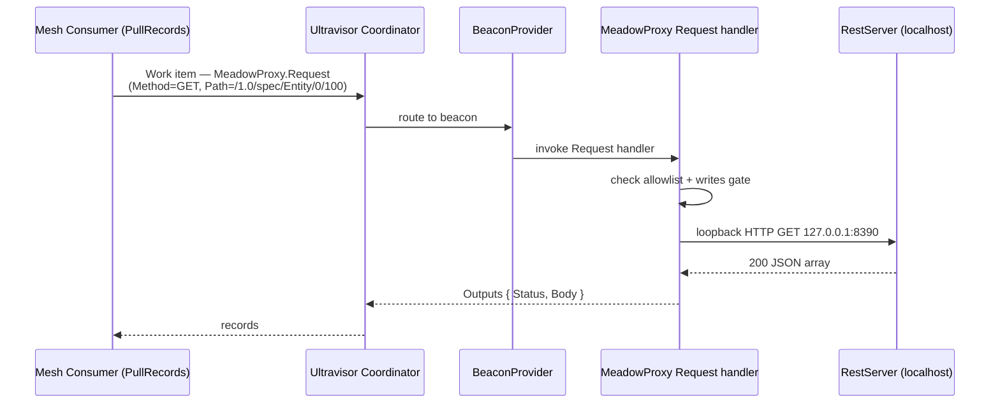
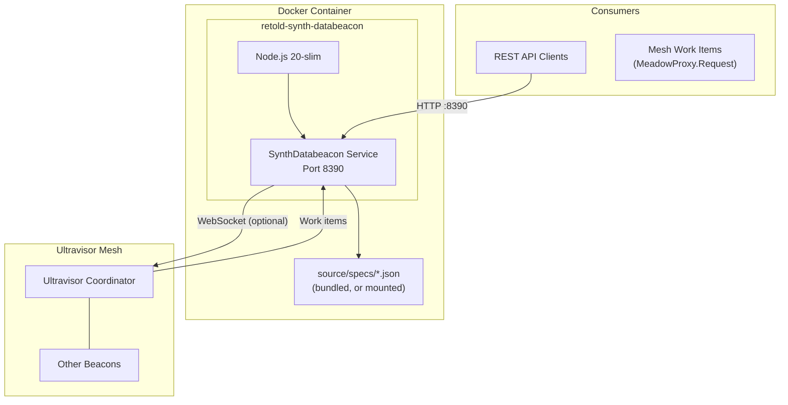

# Retold SynthDatabeacon Architecture

## System Overview

Retold SynthDatabeacon is a small, stateless service that turns a declarative spec into a meadow-shape REST surface. It holds no database and no persisted state -- specs are loaded into memory at startup and records are generated on each request, deterministically, from a seed.

The service is assembled as a `fable-serviceproviderbase` provider (`RetoldSynthDatabeacon`) that stands up an Orator HTTP server and a handful of sub-services. The CLI entry point wraps it in a plain fable container (not pict -- there is no web UI to bundle, which keeps the runtime image lean).

## Component Architecture



## Service Architecture

The core service constructor (`Retold-SynthDatabeacon.js`) wires the dependency graph: it adds the Orator stack, ensures an `ExpressionParser` exists, registers the `synth_*` functions on it, instantiates the SpecRegistry and Evaluator as plain fable services, and instantiates the RestServer and BeaconProvider sub-services. `initializeService` then starts Orator, installs body and query parsers, loads specs from disk, registers any inline specs, and connects the REST routes.

### SpecRegistry

`SynthBeacon-SpecRegistry` is the in-memory store for named specs. At startup it scans the configured spec directory for `*.json` files and registers each one; a file that fails to parse or validate is logged and skipped, so one bad spec does not block the rest. Specs can also be added at runtime through `registerSpec(obj)` (used for tests and operator-supplied specs via the core service's `InlineSpecs` option).

On registration it validates the spec shape (a `Name`, a non-empty `Entities` array, each entity carrying an `Entity` name) and builds a per-entity index inside a deep clone so callers cannot mutate the stored copy. Duplicate entity names within a spec are rejected.

Public surface:

- `registerSpec(spec)` -- validate and store one multi-entity spec; returns the spec name.
- `loadSpecsFromDirectory(path)` -- register every `*.json` file in a directory; returns the names loaded.
- `getSpec(name)` -- the full stored spec object, or `null`.
- `getEntity(spec, entity)` -- the per-entity sub-spec the Evaluator consumes (`Entity`, `Count`, `Fields`, and a resolved `GlobalSeed`), or `null`.
- `listSpecs()` / `listEntities(spec)` -- light summaries for the discovery routes, excluding the heavyweight `Fields` arrays.
- `hasSpec(name)` -- cheap existence check.

`getEntity` resolves the effective `GlobalSeed` with the precedence: a per-entity `GlobalSeed`, then the parent spec's `GlobalSeed`, then the spec `Name`.

### SolverFunctions

`SynthBeacon-SolverFunctions` registers the `synth_*` function family on a fable ExpressionParser. The functions are exposed on `fable.Synth` and registered by address (for example `fable.Synth.firstName`) under names like `synth_firstName`. Each function reads the current per-cell seed from `fable.SynthContext.seed`, instantiates a fresh `Chance(seed)`, calls one chance.js method, and returns the result. Registration is idempotent -- a guard skips re-registration if it has already run on that fable.

Two conventions are load-bearing for spec authors and are enforced by fable's parser, not by these functions:

- **Double-quoted string literals only.** fable's ExpressionParser does not honor single-quote string boundaries; `'2020-01-01'` is tokenized as the math `2020 - 01 - 01` and collapses to `-1`. Use `"..."` for every string argument.
- **`+` is numeric, not concatenation.** To join strings use the variadic `CONCAT(...)`; `FirstName + " " + LastName` does not produce a string.

See the [Specs Guide](specs.md) for the complete function table.

### Evaluator

`SynthBeacon-Evaluator` generates records by driving the ExpressionParser one cell at a time. `generate(spec, seed)` produces the full set; `generateRange(spec, seed, beginIndex, count)` produces a slice. Begin and count are clamped against `spec.Count`, so an over-reaching page request returns the available tail instead of erroring.

For each row the Evaluator seeds a data object with row metadata (`RecordIndex`, `Entity`, `GlobalSeed`) and resolves fields top-to-bottom. Each completed field is written back into that data object before the next field is solved, so **later fields can reference earlier columns by name** (this is how `FullName` is built from `FirstName` and `LastName`). The metadata symbols are stripped before the row is returned, so the produced record is exactly the spec's columns.

Per-cell seeding is the heart of the determinism model. Before each solve the Evaluator sets:

```
fable.SynthContext.seed = sha1(globalSeed || entity || recordIndex || column)
```

The four coordinates are joined with `||` so collisions are effectively impossible. Because the seed changes per cell rather than per row, editing one column's expression shifts only that column's output and leaves every other cell bit-stable. The SynthContext is snapshotted and restored around a generation run so a caller using the same fable's ExpressionParser elsewhere does not see synth state bleed in.

Two ergonomic behaviors smooth spec authoring:

- An expression with no top-level assignment is auto-prefixed with `Result = `, so authors write `synth_email()` rather than `Result = synth_email()`. A small detector skips comparison operators (`==`, `>=`, `<=`, `!=`) to avoid false positives.
- A field whose expression fails to evaluate degrades to `null` and logs a warning rather than aborting the whole generation -- one bad cell does not kill the page. Empty or whitespace-only expressions produce an empty-string column.

### RestServer

`SynthBeacon-RestServer` wires the HTTP routes onto the Orator server. It registers the `/synth/*` discovery routes and the meadow-shape `/1.0/*` data routes. Route order matters: the more specific `/Count` and `/:offset/:count` routes are registered before the catch-all default list route.

| Route | Handler behavior |
|-------|------------------|
| `GET /synth/health` | Returns `{ Status: "OK", Service: "retold-synth-databeacon" }`. |
| `GET /synth/specs` | Returns `listSpecs()`. |
| `GET /synth/specs/:specName` | Returns the spec with the internal `_EntityIndex` stripped, or 404. |
| `GET /synth/specs/:specName/entity/:entityName` | Returns the resolved entity definition, or 404. |
| `GET /1.0/:specName/:entityPlural/Count` | Returns the entity `Count` as a bare integer (meadow shape), or 404. |
| `GET /1.0/:specName/:entityPlural/:offset/:count` | Generates and returns the requested slice. |
| `GET /1.0/:specName/:entityPlural` | Generates the default first page (up to 100 rows). |

Entity-segment resolution (`_lookupEntity`) tries the literal segment first, then strips a single trailing `s`. That handles both the meadow plural convention (`Customers` to `Customer`) and entities whose names already end in `s` (such as `Status`).

Generation is synchronous. The RestServer's comments note that CPU-bound generation of very large slices (10K+ rows) cooperates poorly with the event loop, and that the BeaconProvider / Ultravisor worker path is the better venue for those.

### BeaconProvider

`SynthBeacon-BeaconProvider` registers the service as a beacon in the Ultravisor mesh. It requires the optional `ultravisor-beacon` library; that dependency is loaded inside a `try/catch`, so the service still runs as a standalone REST surface when the library is absent. `connectBeacon(config, callback)` instantiates the beacon, registers the MeadowProxy capability, and enables the beacon. Capability registration happens *before* enable, because `registerCapability` mutates an internal map the beacon flushes to the coordinator at enable time.

The standalone CLI does not enable the beacon by default (`Endpoints.BeaconProvider: false`); it only calls `connectBeacon` when `SYNTHBEACON_ULTRAVISOR_URL` is set, and always with `AllowWrites: false`.

### MeadowProxyProvider

`SynthBeacon-MeadowProxyProvider` defines the single `MeadowProxy` capability. Its one action, `Request`, receives an HTTP descriptor (`Method`, `Path`, `Body`, optional `RemoteUser`) from the mesh and proxies it to the beacon's own localhost REST server over a loopback HTTP request. This is what makes the meadow-shape `/1.0/*` surface reachable through the mesh, and is the mechanism by which SynthDatabeacon is a drop-in source: the capability name and the action shape match what retold-databeacon's MeadowProxy ships, so a consumer targeting `MeadowProxy` works against either beacon.

Two safety gates apply to every proxied request:

- **Path allowlist.** By default only `/1.0/<spec>/<entity>...` paths are allowed (the spec name is the segment a compiled PullRecords URL fills in). Anything else is rejected.
- **Writes disabled.** Non-`GET`/`HEAD` methods are rejected unless `AllowWrites` is explicitly enabled. SynthDatabeacon is read-only by nature.

The loopback request targets `fable.settings.APIServerAddress` (default `127.0.0.1`) and `fable.settings.APIServerPort` (default `8390`), and stamps an internal header so the RestServer can tell mesh-originated requests apart.

## Request Flow

### Direct REST Read



### Mesh Read via MeadowProxy



## Deployment Architecture



The Docker image is a multi-stage build on `node:20-slim`. The builder stage runs `npm install` (not `npm ci` -- the lockfile is gitignored upstream, the same convention retold-databeacon uses) and copies `source/` and `bin/`; the runtime stage reinstalls with `--omit=dev` and copies the built tree. There is no browser bundle. The image exposes port 8390 and defines a `HEALTHCHECK` that polls `/synth/health` every 30 seconds.

Default port: **8390**. Override with `--port`, `SYNTHBEACON_PORT`, or `PORT`. The non-default choice (8389 is retold-databeacon's) lets the two beacons coexist in one compose stack.

## State and Concurrency

SynthDatabeacon keeps no persistent state -- specs live in memory and records are regenerated per request. `fable.SynthContext` is mutable shared state within a single process, which is correct for the current single-threaded, per-work-item pattern. Distributing generation across workers would require flowing the seed through as an explicit parameter on each `synth_*` call; for now the shared-context approach keeps specs free of a per-line seed argument.
